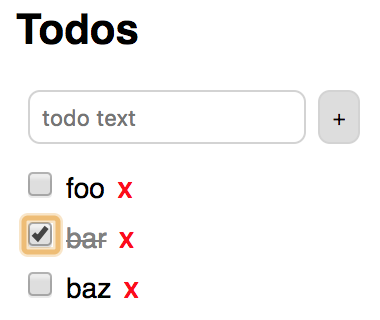

# React Hooks

## Overview

Hooks are a feature added in React 16.7.0-alpha.0.
They enable implementing stateful components
with functions instead of classes. There are no plans
to remove existing ways of implementing components.
Hooks simply provide a new way that
most developers will find easier to understand
and is backward-compatible with existing code.

Components that use hooks can be used together
with class-based components.
Existing apps can choose to gradually incorporate hooks
or never use them.

Eventually it will be possible to use function components
to do everything that is currently possible with class components.
However, currently there are some lifecycle methods
(`componentDidCatch` and `getSnapshotBeforeUpdate`)
whose functionality cannot yet be implemented when using hooks.

Hooks are currently considered experimental
and the API may still change.

## Benefits of Hooks

Hooks support implementing nearly any component
without creating a class.
Many developers find classes confusing
because they need to understand the `this` keyword,
what it means to `bind` a function, and when to do it.

Optimizing code that uses functions is easier
than optimizing code that uses classes.
This refers to minifying, hot reloading, and tree shaking.

Hooks provide easier ways to work with component state and context.

Hooks make it easier to reuse state logic between multiple components.
In most cases this removes the need
for higher-order components and render props,
both of which require increased levels of code nesting.

Hooks support using "effects" in place of lifecycle methods.
This makes it possible to better organize related code
such as adding/removing event listeners and
opening/closing resources.

## Rules For Hooks

Hook function names should start with "use".
This convention allows linting rules to check for proper use of hooks
and provides a clue that the function may access state.

Hook functions can only be called in
function-based components and in custom hooks.

Hook functions cannot be called conditionally.
This means they cannot be called in
if/else blocks, loops, or nested functions.
This ensures that for any component,
the same hooks are invoked
in the same order on every render.

React provides ESLint rules to detect violations of these rules.
See <https://www.npmjs.com/package/eslint-plugin-react-hooks>.
This currently implements a single rule named "react-hooks/rules-of-hooks"
that should be configured with a value of "error".
This rule assumes that any function whose name begins
with "use" followed by an uppercase letter is a hook.
It verifies that hooks are only called from
function components (name starts uppercase)
or custom hook functions.
It also verifies that hooks will be called
in the same order on every render.

A future version of create-react-app will automatically
configure the `react-hooks/rules-of-hooks` ESLint rule.

## Provided Hooks

The hooks provided by React are implemented as functions
that are exported by the `react` package.

Each of the provided hooks is described in the following sections.
They are somewhat ordered based on
how frequently they are expected to be used.

### State Hook

This provides a way to add state to function components.

The `useState` function is a hook that takes the initial value of the state
and returns an array containing the current value and a function to change it.
It allows a component to use state without using the `this` keyword.

For example, the following code can appear
inside a function that defines a component.

```js
const [petName, setPetName] = useState('Dasher');
const [petBreed, setPetBreed] = useState('Whippet');
```

In this example,
`petName` holds the current value of the state.
`setPetName` is a function that can be called to change the value.
These "set" functions can be passed a new value, or
a function that will be passed the current value and returns the new value.
Calls to them trigger the component to be re-rendered.

Often the state is a primitive value,
but it can also be an object or array (also an object).
If a state value is an object,
calls to the corresponding set function
must pass an entire new value.
The set functions do not merge the object
passed to them with the current value
as is done by the `Component` `setState` method.

Note that the `useState` calls are made
every time the component is rendered.
This allows the component to obtain
the current value for each piece of state.
Initial values are only be applied during the first render.

Here is a complete component definition that uses the state hook:

```js
import React, {useState} from 'react';

export default function Pet() {
  const [petName, setPetName] = useState('Dasher');
  const [petBreed, setPetBreed] = useState('Whippet');
  const changeBreed = e => setPetBreed(e.target.value);
  const changeName = e => setPetName(e.target.value);
  return (
    <div>
      <label htmlFor="name">
        Name
        <input id="name" onChange={changeName} value={petName} />
      </label>
      <br />
      <label htmlFor="breed">
        Breed
        <select
          id="breed"
          onBlur={changeBreed}
          onChange={changeBreed}
          value={petBreed}
        >
          <option>Greyhound</option>
          <option>Italian Greyhound</option>
          <option>Whippet</option>
        </select>
      </label>
      <div>
        {petName} is a {petBreed}.
      </div>
    </div>
  );
}
```

It's not necessary to understand how this works, but it is interesting.
The state values for a component are stored in a linked list.
Each call to `useState` associates a state value
with a different node in the linked list.
In the example above, `petName` is stored in the first node
and `petBreed` is stored in the second node.

### Effect Hook

The `useEffect` hook provides an alternative to lifecycle methods like
`componentDidMount`, `componentDidUpdate`, and `componentWillUnmount`
in function components.

Effects have two phases, setup and cleanup.
Think of setup as being performed when a class component
would call `componentDidMount` or `componentDidUpdate`,
which is after React updates the DOM.
Think of cleanup as being performed when a class component
would call `componentWillUnmount`.

Examples of setup functionality include
fetching data (ex. calling a REST service),
registering an event listener,
opening a network connection,
and starting a timeout or interval.

Examples of cleanup functionality include
unregistering an event listener,
closing a network connection,
and clearing a timeout or interval.

An effect is configured by calling the `useEffect` function
which takes a function that performs the setup.
If no cleanup is needed, this function returns nothing.
If cleanup is need, this function returns another that performs the cleanup.

For example:

```js
useEffect(() => {
  console.log('performing setup');
  return () => {
    console.log('performing cleanup');
  };
});
```

The `useEffect` function can be called any number of times
inside a function component.
It is typically called once for each distinct kind of effect
rather than combining the code for multiple effects in a single call.

In the first render of a component,
the order of execution is:

1. all the code in the component function
2. the setup code in all the effects in the order defined

In subsequent renders, the order of execution is:

1. all the code in the component function
2. the cleanup code in all the effects in the order defined (not reverse order)
3. the setup code in all the effects in the order defined

If it is desirable to prevent the setup and cleanup code
from running in every render, supply a second argument to
the `useEffect` function that is an array of variables.
The cleanup and setup steps are only executed again if
any of these variables have changed since the last call.

One use of an effect is to move focus to a particular input.
This is demonstrated in the "Ref Hook" section later.

### Context Hook

The `useContext` hook provides an alternative way to
consume context state in function components.

Hooks do not change the way context providers are implemented.
They are still implemented by creating a class that
extends from `React.Component` and renders a `Provider`.
For details, see <https://reactjs.org/docs/context.html>.

Suppose a context provider has been implemented
in the component `SomeContext`.
The `useContext` hook can be used in another component
to access its state. For example:

```js
import {SomeContext} from './some-context';

export default MyComponent() {
  const context = useContext(SomeContext);
  return <div>{context.someData}</div>;
}
```

The `context` variable is set to an object that provides
read-only access to the state properties of the context
and access to any methods defined on it.
These methods can provide a way for context consumers
to modify the context state.

Directly setting properties on the `context` variable
affects the local object, but not the context state.
Doing this is not flagged as an error.

Calling the `useContext` function also
subscribes the function component to context state updates.
Whenever the context state changes,
the function component is re-rendered.

To avoid re-rendering the component on every context state change,
wrap the returned JSX in a call to `useCallback` described next.

A great use of the `useContext` hook is in
conjunction with the npm package "context-easy".
See <https://www.npmjs.com/package/context-easy>.

### Callback Hook

The `useCallback` hook takes an expression and
an array of variables that affect the result.
It returns a memoized value.
Often the expression is a function.

This can be used to avoid recreating callback functions
defined in function components every time they are rendered.
Such functions are often used as DOM event handlers.

For example, consider the difference between these:

```js
<input onChange={e => processInput(e, color, size)}>
<input onChange={useCallback(e => processInput(e, color, size), [color, size]}>
```

These lines have the same functionality,
but the second line only creates a new function
for the `onChange` prop when the value of
`color` or `size` has changed since the last render.
Avoiding the creation of new callback functions
allows the React reconciliation process to correctly
determine whether the component needs to be re-rendered.
Avoiding unnecessary renders provides a performance benefit.

If the callback function does not depend on any variables,
pass an empty array for the second argument.
This causes `useCallback` to always return the same function.
If the second argument is omitted,
a new function will be returned on every call
which defeats the purpose.
(Why doesn't `useCallback` treat omitting the
second argument the same as passing an empty array?)

The `useCallback` hook can also serve as a substitute
for the lifecycle method `shouldComponentUpdate`
available in class components.
For example, suppose `v1` and `v2` are variables
whose values come from calls to `useState` or `useContext`
and these are used in the calculation of JSX to be rendered.
To only calculate new JSX if one or both of them
have changed since the last render,
pass the JSX as the first argument to `useCallback`.

For example:

```js
return useCallback(<div>component JSX goes here.</div>, [v1, v2]);
```

### Memo Hook

The `useMemo` hook takes a function and
an array of variables that affect the result.
It memoizes the function and returns its current result.

For example, suppose `x` and `y` are variables
whose values come from calls to `useState` or `useContext`
and we need to compute a value based on these.
The following code reuses the previous result
if the values of `x` and `y` have not changed.

```js
const hypot = useMemo(
  () => {
    console.log('calculating hypotenuse');
    return Math.sqrt(x * x + y * y);
  },
  [x, y]
);
```

This only remembers the result for the last set of input values.
It does not store all past unique calculations.

Note the difference between `useCallback` and `useMemo`.
While both provide memoization,
`useCallback` returns a value (which could be a function) and
`useMemo` returns the result of calling a function.

### React.memo function

The `React.memo` function, not a hook, that was added in React 16.6.
It memoizes a function component so
it is only re-rendered if at least one of its props has changed.
This does what class components do when they
extend from `PureComponent` instead of `Component`.

For example, the following code defines a `Percent` component
that renders the percentage a count represents of a total.

```js
import React from 'react';

export default React.memo(({count, total}) => {
  console.log('Percent rendering'); // to verify when this happens
  return <span>{((count / total) * 100).toFixed(2)}%</span>;
});
```

### Reducer Hook

The `useReducer` hook supports implementing components
whose state is updated by dispatching actions
that are handled by a reducer function.
It is patterned after Redux.
It takes a reducer function and the initial state.

Here's an example of a very simple todo app
that uses this hook. It uses Sass for styling.
Note how the `TodoList` component calls `useReducer`
to obtain the `state` and the `dispatch` function.
It calls the `dispatch` function
in its event handling functions.



#### todo-list.scss

```scss
.todo-list {
  .delete-btn {
    background-color: transparent;
    border: none;
    color: red;
    font-weight: bold;
  }

  .done-true {
    color: gray;
    text-decoration: line-through;
  }

  form {
    margin-bottom: 10px;
  }

  .todo {
    margin-bottom: 0;
  }
}
```

#### todo-list.js

```js
import React, {useReducer} from 'react';
import './todo-list.scss';

const initialState = {
  text: '',
  todos: []
  // objects in this have id, text, and done properties.
};

let lastId = 0;

function reducer(state, action) {
  const {text, todos} = state;
  const {payload, type} = action;
  switch (type) {
    case 'add-todo': {
      const newTodos = todos.concat({id: ++lastId, text, done: false});
      return {...state, text: '', todos: newTodos};
    }
    case 'change-text':
      return {...state, text: payload};
    case 'delete-todo': {
      const id = payload;
      const newTodos = todos.filter(todo => todo.id !== id);
      return {...state, todos: newTodos};
    }
    case 'toggle-done': {
      const id = payload;
      const newTodos = todos.map(
        todo => (todo.id === id ? {...todo, done: !todo.done} : todo)
      );
      return {...state, todos: newTodos};
    }
    default:
      return state;
  }
}

export default function TodoList() {
  const [state, dispatch] = useReducer(reducer, initialState);

  const handleAdd = useCallback(() => dispatch({type: 'add-todo'}));
  const handleDelete = useCallback(id =>
    dispatch({type: 'delete-todo', payload: id})
  );
  const handleSubmit = useCallback(e => e.preventDefault()); // prevents form submit
  const handleText = useCallback(e =>
    dispatch({type: 'change-text', payload: e.target.value})
  );
  const handleToggleDone = useCallback(id =>
    dispatch({type: 'toggle-done', payload: id})
  );

  return (
    <div className="todo-list">
      <h2>Todos</h2>
      <form onSubmit={handleSubmit}>
        <label htmlFor="text">
          <input
            placeholder="todo text"
            onChange={handleText}
            value={state.text}
          />
        </label>
        <button onClick={handleAdd}>+</button>
      </form>
      {state.todos.map(todo => (
        <div className="todo" key={todo.id}>
          <input
            type="checkbox"
            onChange={() => handleToggleDone(todo.id)}
            value={todo.done}
          />
          <span className={`done-${todo.done}`}>{todo.text}</span>
          <button className="delete-btn" onClick={() => handleDelete(todo.id)}>
            X
          </button>
        </div>
      ))}
    </div>
  );
}
```

### Ref Hook

The `useRef` hook provides an alternative to using
class component instance variables in function components.
Refs persist across renders.
They differ from capturing data using the `useState` hook in that
changes to their values do not trigger the component to re-render.

The `useRef` function takes the initial value and returns
an object whose `current` property holds the current value.

A common use is to capture references to DOM nodes.

For example, in the Todo app above we can
automatically move focus to the text input.
To do this we need to:

1. import the `useEffect` and `useRef` hooks
2. create a ref inside the function
3. add an effect to move the focus
4. set the ref using the `input` element `ref` prop

```js
const inputRef = useRef();
useEffect(() => inputRef.current.focus());

return (
  ...
  <input
    placeholder="todo text"
    onChange={handleText}
    ref={inputRef}
    value={state.text}
  />;
  ...
)
```

Ref values are not required to be DOM nodes.
For example, suppose we wanted to log the number of todos
that have been deleted every time one is deleted.
To do this we need to:

1. create a ref inside the function that holds a number
2. increment the ref value every time a todo is deleted
3. log the current value

```js
const deleteCountRef = useRef(0); // initial value is zero

// Modified version of the handleDelete function above.
const handleDelete = id => {
  deleteCountRef.current++;
  dispatch({type: 'delete-todo', payload: id});
  console.log('You have now deleted', deleteCountRef.current, 'todos.');
};
```

### Imperative Methods Hook

The `useImperativeMethods` hook modifies the instance value
that parent components will see if they obtain a ref
to the current component.

One use is to add methods to the instance
that parent components can call.
For example, suppose the current component contains multiple inputs.
It could use this hook to add a method to its instance value
that parent components can call to move focus to a specific input.

### Layout Effect Hook

The `useLayoutEffect` hook is used to query and modify the DOM.
It is similar to `useEffect`,
but differs in that the function passed to it
is invoked after every DOM mutation in the component.
DOM modifications are applied synchronously.

One use for this is to implement animations.

### Mutation Effect Hook

The `useMutationEffect` hook is used to modify the DOM.
It is similar to `useEffect`,
but differs in that the function passed to it
is invoked before any sibling components are updated.
DOM modifications are applied synchronously.

If it is necessary to also query the DOM,
the `useLayoutEffect` hook should be used instead.

## Custom Hooks

A custom hook is a function whose
name begins with "use" and
calls one more hook functions.
They typically return an array or object
that contains state data and
functions that can be called to modify the state.

Custom hooks are useful for extracting hook functionality
from a function component so it can be
reused in multiple function components.

For example, Dan Abramov demonstrated a custom hook
that watches the browser window width.

```js
function useWindowWidth() {
  // This maintains the width state for any component that calls this function.
  const [width, setWidth] = useState(window.innerWidth);
  useEffect(() => {
    // setup steps
    const handleResize = () => setWidth(window.innerWidth);
    windowAddEventListener('resize', handleResize);
    return () => {
      // cleanup steps
      windowRemoveEventListener('resize', handleResize);
    };
  });
}
```

To use this in a function component:

```js
const width = useWindowWidth();
```

Another example Dan Abramov shared simplifies
associating a state value with a form input.
It assumes the state does not need to be
maintained in an ancestor component.

```js
function useFormInput(initialValue) {
  const [value, setValue] = useState(initialValue);
  const onChange = e => setValue(e.target.value);
  // Returning these values in an object instead of an array
  // allows it to be spread into the props of an HTML input.
  return {onChange, value};
}
```

To use this in a function component that
renders an `input` element for entering a name:

```js
const nameProps = useFormInput('');

return (
  <input {...nameProps} />;
);
```

## Third Party Hooks

The React community is busy creating and sharing additional hooks.
Many of these are listed at <https://nikgraf.github.io/react-hooks/>.

## Conclusion

Hooks are a great addition to React!
They make implementing components much easier.
They also likely spell the end of
implementing React components with classes.
However, you may not want to use them in production apps
just yet since they are still considered experimental
and their API may change.

## Resources

"React Today and Tomorrow and 90% Cleaner React" talk at React Conf 2018
by Sophie Alpert, Dan Abramov, and Ryan Florence\
<https://www.youtube.com/watch?v=dpw9EHDh2bM&t=2792s>

"Introducing Hooks" Official Documentation in 8 parts\
<https://reactjs.org/hooks>

egghead.io Videos from Kent Dodds\
<https://egghead.io/lessons/react-use-the-usestate-react-hook>

"Everything you need to know about React Hooks" by Carl Vitullo\
<https://medium.com/@vcarl/everything-you-need-to-know-about-react-hooks-8f680dfd4349>
